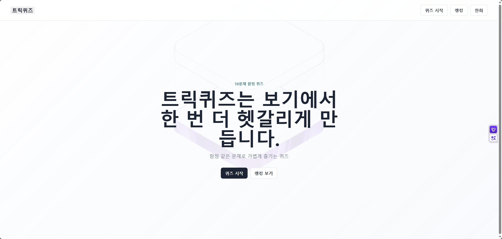
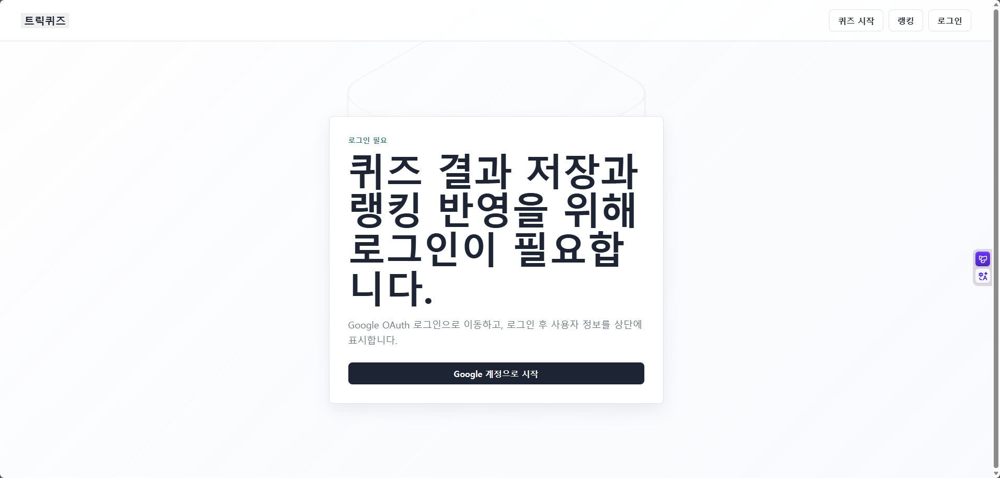
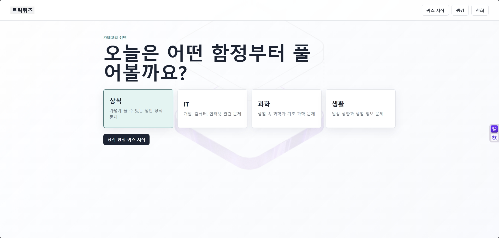
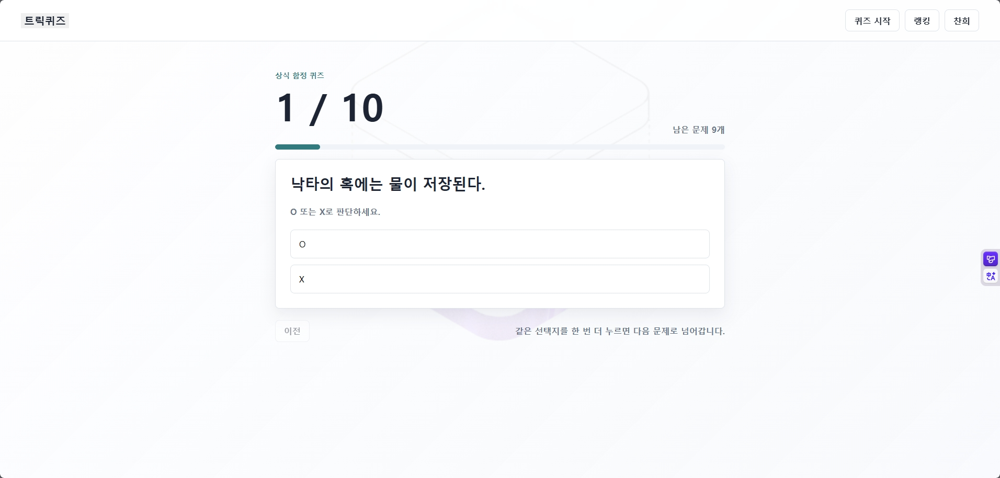
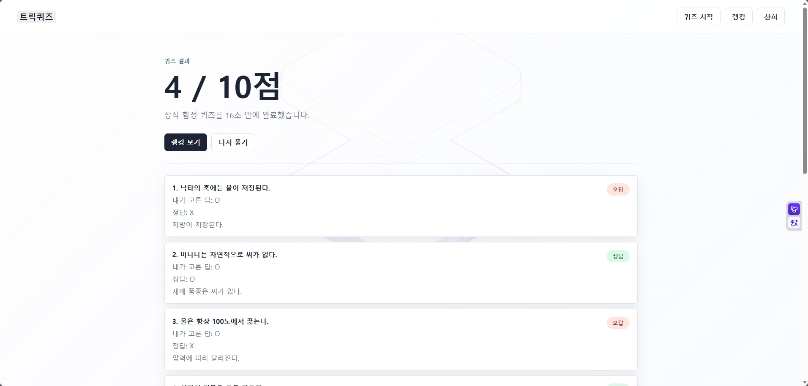
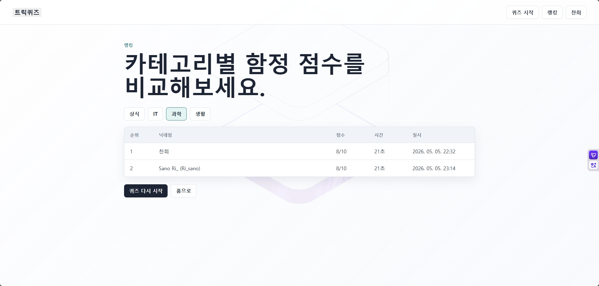
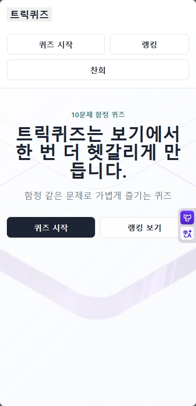

# 트릭퀴즈

정답은 단순하지만 보기는 헷갈리게 만든 O/X 함정 퀴즈 프로젝트입니다.

포트폴리오용으로 만든 웹 서비스이며, Google OAuth 로그인, 퀴즈 진행, 결과 저장, 랭킹 조회까지 실제 API와 DB를 연결해 구현했습니다.

## 주요 기능

- Google OAuth 로그인
- 사용자 정보 상단 표시
- O/X 형식 퀴즈 진행
- 퀴즈 결과 저장
- 카테고리별 랭킹 조회
- 로그아웃
- 모바일 대응 카테고리 2열 레이아웃

## 기술 스택

| 영역 | 기술 |
|---|---|
| Frontend | React, TypeScript, Vite |
| Backend | Spring Boot, Spring Security, OAuth2 |
| Database | PostgreSQL |
| Infra | Docker Compose |
| Test | Maven test, ESLint, Vite build |

## 프로젝트 구조

```text
tricky-quiz
├─ frontend
├─ backend
└─ docs
   ├─ 01-project-plan.md
   ├─ 02-requirements.md
   ├─ 03-screen-design.md
   ├─ 04-menu-tree.md
   ├─ 05-tech-stack.md
   ├─ 06-database-design.md
   ├─ 07-api-spec.md
   ├─ 08-roadmap.md
   ├─ 09-dev-log.md
   ├─ 10-test-plan.md
   └─ 11-open-questions.md
```

## 실행 방법

### 1. DB 실행

```bash
docker compose up -d
```

### 2. 백엔드 실행

```bash
cd backend
./mvnw spring-boot:run
```

Windows PowerShell에서는:

```powershell
cd backend
.\mvnw.cmd spring-boot:run
```

### 3. 프론트엔드 실행

```bash
cd frontend
npm install
npm run dev
```

브라우저에서 `http://localhost:5173`로 접속한다.

## 데모 모드

이 프론트엔드는 백엔드 API가 연결되지 않아도 데모 모드로 동작한다.

- GitHub Pages처럼 정적 호스팅만 가능한 환경에서는 자동으로 데모 모드 안내가 표시된다.
- 데모 모드에서는 샘플 O/X 문제, 결과, 랭킹 데이터를 보여준다.
- 실제 백엔드가 연결된 환경에서는 Google OAuth 로그인과 서버 API를 사용한다.

## 환경 변수

백엔드 실행 시 다음 값이 필요하다.

| 이름 | 설명 |
|---|---|
| `GOOGLE_CLIENT_ID` | Google OAuth Client ID |
| `GOOGLE_CLIENT_SECRET` | Google OAuth Client Secret |
| `FRONTEND_URL` | 로그인 후 돌아올 프론트 주소 |
| `DB_URL` | PostgreSQL 접속 URL |
| `DB_USERNAME` | PostgreSQL 사용자명 |
| `DB_PASSWORD` | PostgreSQL 비밀번호 |

VS Code 실행 설정은 `.vscode/launch.json`에서 관리할 수 있다.

## 테스트 방법

### 백엔드

```bash
cd backend
./mvnw test
```

### 프론트엔드

```bash
cd frontend
npm run lint
npm run build
```

## 테스트 문서

- [테스트 계획](./docs/10-test-plan.md)
- [고민 목록](./docs/11-open-questions.md)
- Google Sheets 테스트 케이스: https://docs.google.com/spreadsheets/d/1mV7YmM_DHA_KmUq72hfjmdo5noZTF4epx7f-teHFLZM/edit?usp=sharing

## 문서

- [프로젝트 계획](./docs/01-project-plan.md)
- [요구사항](./docs/02-requirements.md)
- [화면 설계](./docs/03-screen-design.md)
- [메뉴 트리](./docs/04-menu-tree.md)
- [기술 스택](./docs/05-tech-stack.md)
- [DB 설계](./docs/06-database-design.md)
- [API 명세](./docs/07-api-spec.md)
- [로드맵](./docs/08-roadmap.md)
- [개발 로그](./docs/09-dev-log.md)
- [테스트 계획](./docs/10-test-plan.md)
- [고민 목록](./docs/11-open-questions.md)

## 포트폴리오 메모

- 퀴즈 문제는 O/X 형식의 함정 문장으로 구성했다.
- 모바일에서는 카테고리 버튼을 2열로 배치했다.
- 로그아웃은 닉네임 메뉴 안에서 동작한다.
- 테스트는 단위, 슬라이스, 통합, 수동으로 나눠 관리한다.

## 화면 캡처

아래 화면을 README에 넣어두면 프로젝트 흐름을 한눈에 보기 좋습니다.

### 메인 화면


### 로그인 화면


### 카테고리 선택 화면


### 퀴즈 진행 화면


### 결과 화면


### 랭킹 화면


### 모바일 화면

